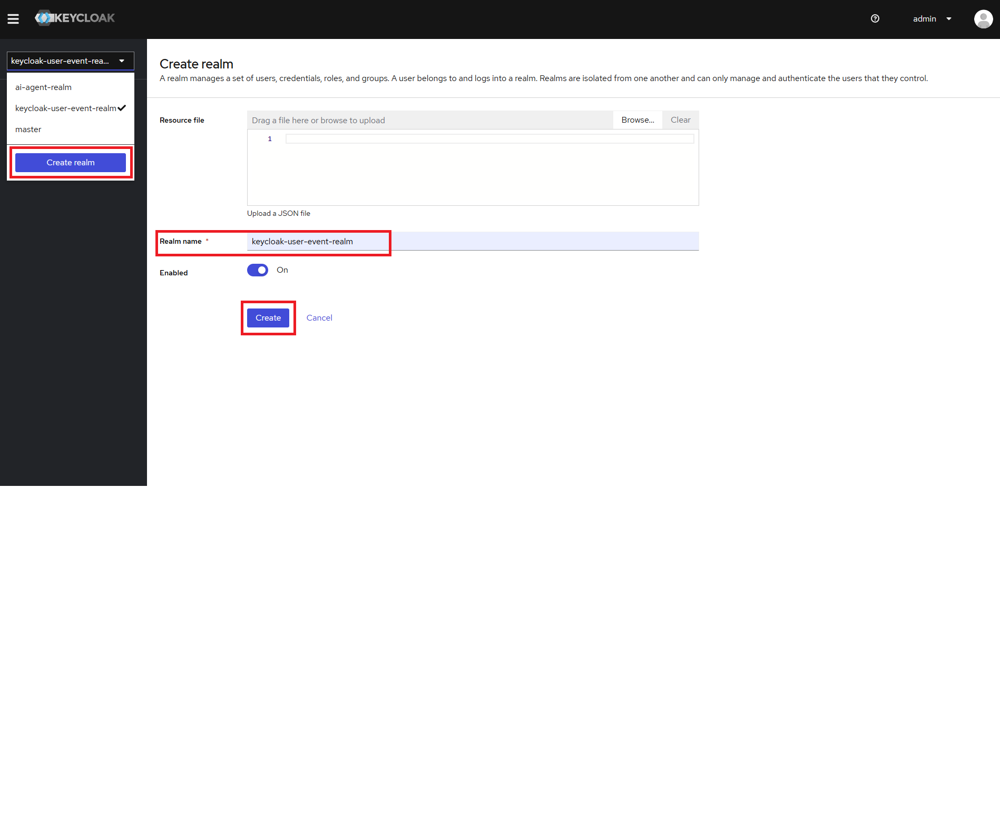
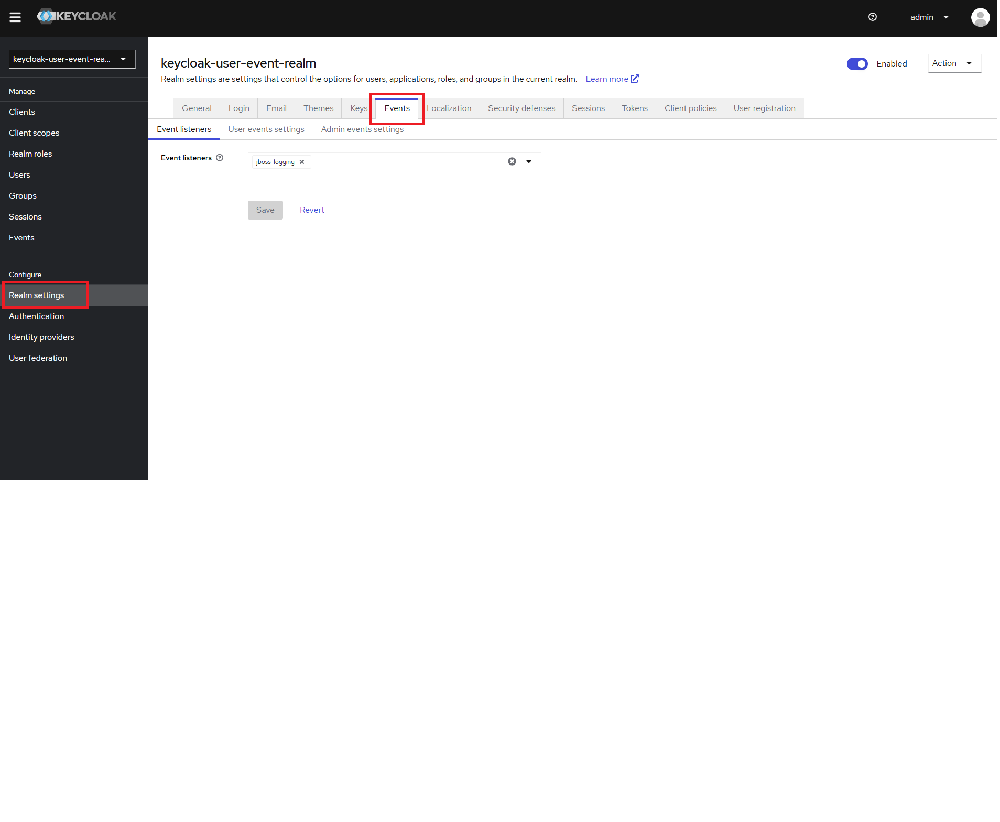
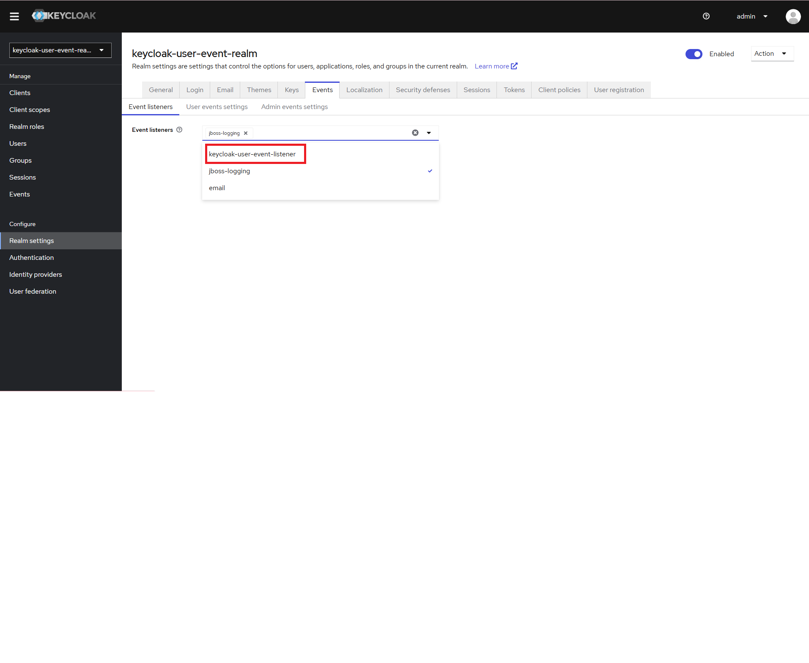
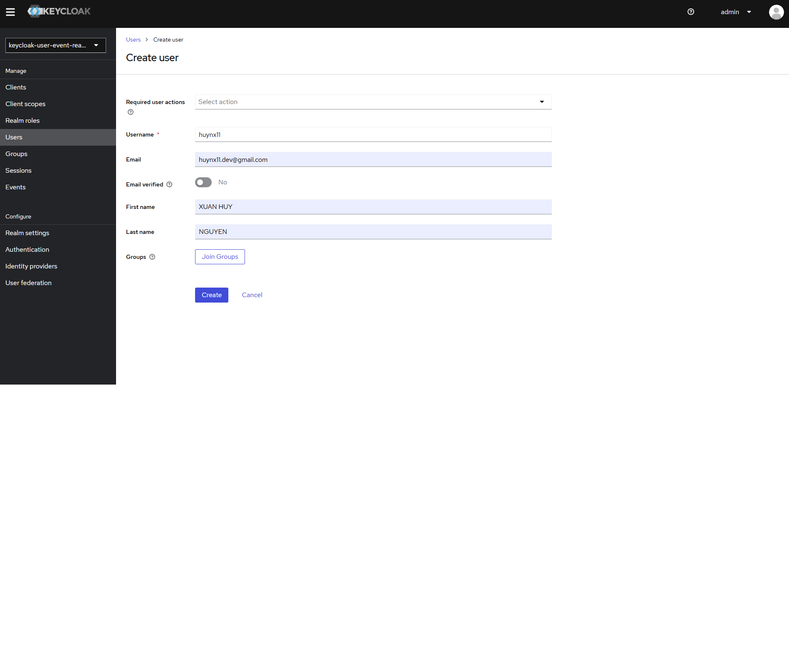
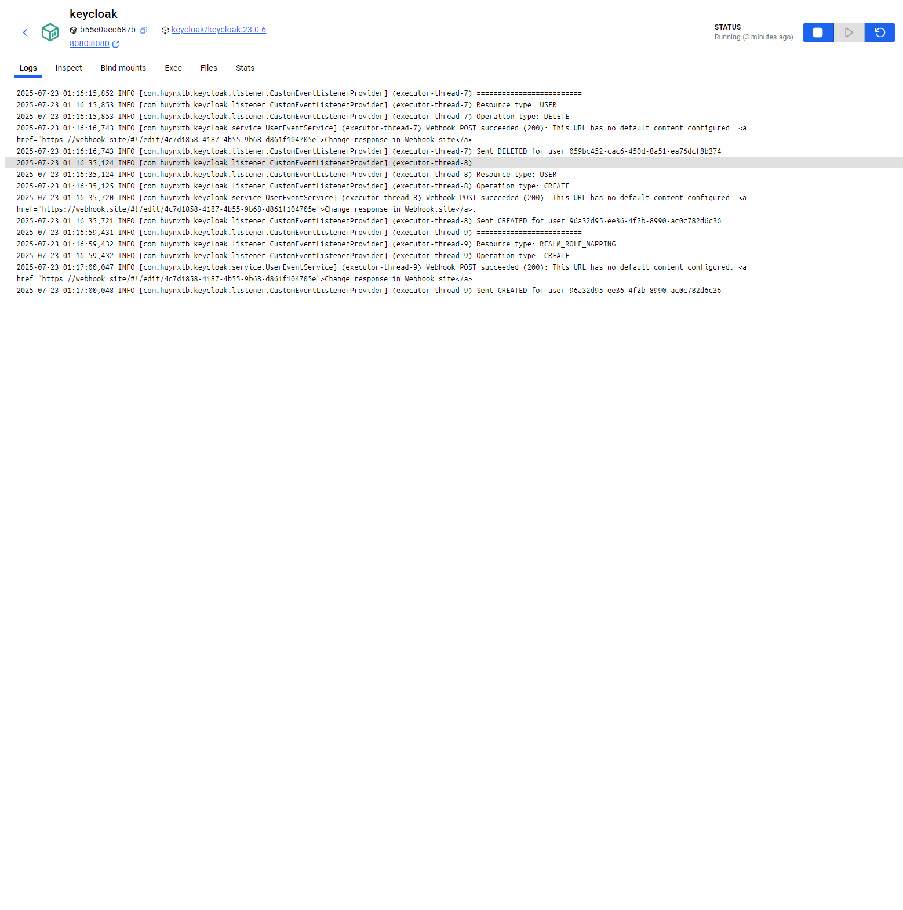
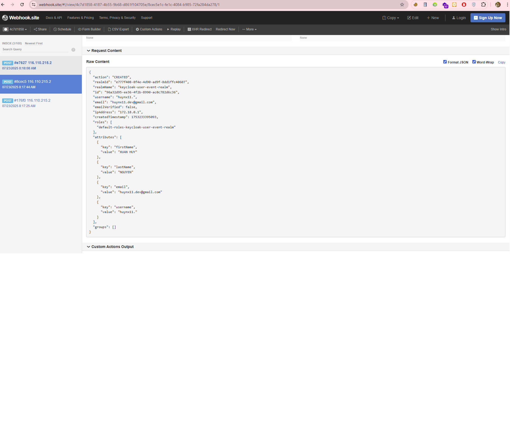

# Keycloak User Event Listener and API Publisher

## TL;DR

A Keycloak extension that listens for user events (create, update, delete, register, login, logout, verify email, etc.) and forwards them to your webhook.

## Supported Event Types

- `CREATED`
- `UPDATED`
- `DELETED`
- `LOGIN`
- `LOGOUT`
- `VERIFY_EMAIL`

## Quick Start

```bash
# Clone the repository
git clone https://github.com/huynxtb/keycloak-user-event-listener.git

cd keycloak-user-event-listener

# Copy example environment file
cp .env.sample .env
# Edit .env and set your WEBHOOK_URL

# Build the extension
mvn clean package

# Copy JAR to Keycloak providers
cp target/keycloak-user-event-listener.jar providers/
```

## Start Keycloak and Configure Listener

### 1. Deploy Keycloak and Postgres

```bash
docker-compose up -d
```

### 2. Set Up Environment Variables

```bash
# Copy example environment file
cp .env.sample .env

# Edit .env and update the WEBHOOK_URL
# Example:
# WEBHOOK_URL=https://your-webhook.com/endpoint
```

### 3. Build the Extension

```bash
mvn clean package
```

### 4. Deploy to Keycloak (Normal installation without Docker)

```bash
# Create providers directory if it doesn't exist
mkdir -p keycloak/providers

# Copy JAR to providers directory
cp target/keycloak-user-event-listener.jar keycloak/providers/
```

### 5. Configure Keycloak

#### Enable Event Listener

1. Access Keycloak Admin Console (default: http://localhost:8080)
2. Log in as admin (default credentials: admin/123456789Aa)
3. Create a new realm  
   
4. Navigate to:
   - Realm settings
   - Events  
   
5. Add `keycloak-user-event-listener`  
   
6. Save

### 6. Configure Webhook

#### Set Up Webhook

1. **Ensure your webhook endpoint is publicly accessible**
2. **Configure the `WEBHOOK_URL` in the `.env` or `docker-compose.yaml` file**

## Usage

### Testing the Integration

#### Local Testing

You can use services like [webhook.site](https://webhook.site) to test the webhook integration:

1. Get a temporary webhook URL from webhook.site
2. Add it to your `.env` file
3. Create a user in Keycloak
4. Check the webhook.site dashboard for the event data

> **Note:** In this test, webhook.site is used.

##### Test Create User

1. Go to Users
2. Add User
3. Fill in the required fields
4. Click "Create" to save the new user  
   
5. View logs from Keycloak  
   
6. Check your webhook endpoint for the notification on webhook.site  
   

7. The JSON response will look like:

```json
{
  "action": "CREATED",
  "realmId": "e777f408-8f4e-4d90-ad9f-8dd1ffc40607",
  "realmName": "keycloak-user-event-realm",
  "id": "96a32d95-ee36-4f2b-8990-ac0c782d6c36",
  "username": "admin",
  "email": "admin@gmail.com",
  "emailVerified": false,
  "ipAddress": "172.18.0.1",
  "createdTimestamp": 1753233395093,
  "roles": [
    "default-roles-keycloak-user-event-realm"
  ],
  "attributes": [
    {
      "key": "firstName",
      "value": "XUAN HUY"
    },
    {
      "key": "lastName",
      "value": "NGUYEN"
    },
    {
      "key": "email",
      "value": "admin@gmail.com"
    },
    {
      "key": "username",
      "value": "admin."
    }
  ],
  "groups": []
}
```

Events for `UPDATED`, `DELETED`, `LOGIN`, `LOGOUT`, and `VERIFY_EMAIL` will have similar payloads with the corresponding `action` value.

## Troubleshooting

### Common Issues

1. **Webhook not receiving events**
   - Check if the `WEBHOOK_URL` in `.env` is correct
   - Verify the event listener is enabled in Keycloak
   - Check Keycloak logs for any errors

2. **Build failures**
   - Ensure Maven is installed
   - Check Java version (requires Java 11+)

### Logs

```bash
# View Keycloak logs
docker-compose logs -f keycloak
```

## Contributing

Pull requests are welcome! For major changes, please open an issue first to discuss what you would like to change.

## License

[Apache-2.0 license](LICENSE)